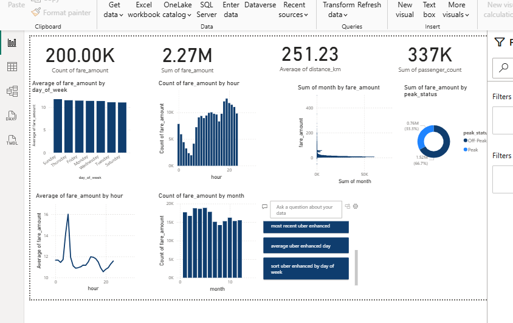
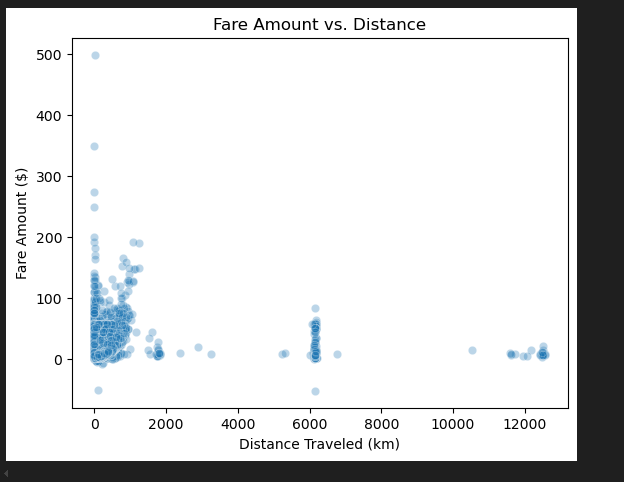
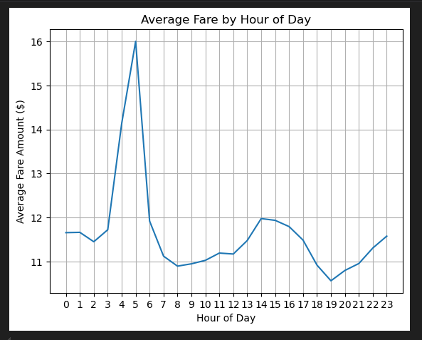

#  Uber Fares Dataset Analysis – Power BI Project

---

#   NAME: UWASE HONETTE   ,                                                       ID:27628

Introduction

This project focuses on analyzing the Uber Fares Dataset to extract insights into pricing patterns, rider behavior, and time-based trends. By using Python for data preparation and Power BI for visualization, the project demonstrates key concepts of data wrangling, exploratory data analysis (EDA), feature engineering, and interactive dashboard design.

---

##  Objectives

- Understand and clean a real-world transportation dataset  
- Explore fare and trip-related patterns using Python and Power BI  
- Create new features for temporal analysis  
- Build an interactive, professional dashboard with insights  
- Provide data-driven business recommendations

---

##  Methodology

### 1. Data Acquisition
- Downloaded dataset from Kaggle
- Imported into Python using Pandas for inspection and preprocessing

### 2. Data Cleaning
- Dropped all rows with missing (null) values using dropna() to ensure data consistency
  
-Assigned the cleaned data to a new DataFrame called data_clearing

-Ensured the resulting dataset had only complete and usable records

-Prepared the cleaned dataset for further analysis and export to Power BI

### 3. Feature Engineering
- Extracted hour, day, month, and weekday from timestamps  
- Created peak/off-peak hour indicator  
- Calculated approximate ride durations (if data allows)  
- Final dataset saved as uber_enhanced.csv

### 4. Exploratory Data Analysis (Python)
- Generated statistics: mean, median, standard deviation  
- Visualized:
  - Fare amount distribution
  - Fare vs distance
  - Rides by time of day and weekday

### 5. Power BI Dashboard
- Imported enhanced dataset into Power BI Desktop  
- Built:
  - Histogram of fare amounts  
  -  Bar charts: Fare by hour, day of week, and month
  -  Donut chart: Fare distribution by peak vs off-peak hours

  - KPI cards: Total fare, average distance, total passengers

  - Interactive slicers: hour, day, month, peak status
- Applied slicers, filters, and interactive drilldowns

---

## Tools and Technologies

- *Python* (Pandas, Seaborn, Matplotlib) – for data preparation and EDA  
- *Power BI Desktop* – for data visualization and interactive dashboard  
- *GitHub* – for version control and submission  
- *Kaggle* – for open-source dataset access

---
##  Screenshots 

###  Power BI Dashboard Overview

###  Fare Distribution Histogram

###  Fare vs Distance Scatter Plot

###  Hourly Ride Trends

